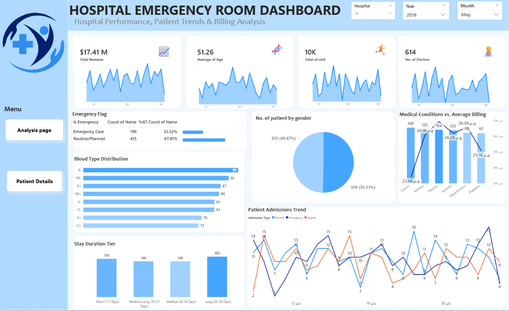

# 🏥 Executive Healthcare Analytics & Clinical Operations Dashboard

An end-to-end Healthcare Analytics solution designed for hospital executive leadership and clinical operations managers. This project integrates **SQL** for data cleaning and transformation, **Python** for Exploratory Data Analysis (EDA) & profiling, and **Power BI** for interactive decision-support visualization.

---

## 📸 Dashboard Preview



---

## 💡 Executive Summary & Key Insights

* **Emergency Blood Demand:** Specific distribution analysis of blood types for emergency admissions to optimize blood bank inventory management.
* **Treatment & Medication Stability:** Evaluates efficacy ratios by tracking normal vs. abnormal test result outcomes across various condition-medication combinations.
* **Length of Stay (LOS) & Cost Drivers:** Identifies patient admission profiles (Elective, Urgent, Emergency) and age demographics that drive longer hospital stays and higher billing amounts.
* **Physician & Clinical Benchmarks:** Measures clinical outcomes, patient load, and operational throughput across attending physicians and hospital departments.

---

## 🛠️ Tech Stack & Methodology

| Stage | Tools & Technologies | Focus Area |
| :--- | :--- | :--- |
| **Data Cleaning** | MySQL | Deduplication, String Normalization, Date Parsing, Key Generation |
| **Data Analysis** | Python (`pandas`, `seaborn`, `matplotlib`) | Descriptive Statistics, Correlation Matrix, Demographic Profiling |
| **Data Modeling & Visualization** | Power BI, DAX, Power Query | Interactive Visuals, Custom Measures, Sorting & Layout Optimization |
| **Documentation & Version Control** | Git, GitHub | Repository Structure, Best Practices, Asset Management |

---

## 🧹 Data Pipeline & Engineering

### 1. SQL Data Cleaning (`MySQL`)
Raw patient records were processed to enforce data integrity, resolve duplicate entries, and build surrogate keys:

```sql
-- 1. Standardize String Capitalization & Clean Names
UPDATE healthcare_dataset
SET Name = CONCAT(
    UPPER(SUBSTRING(Name, 1, 1)), 
    LOWER(SUBSTRING(Name, 2, LOCATE(' ', Name) - 1)), 
    ' ', 
    UPPER(SUBSTRING(Name, LOCATE(' ', Name) + 1, 1)), 
    LOWER(SUBSTRING(Name, LOCATE(' ', Name) + 2))
)
WHERE Name LIKE '% %';

-- 2. Calculate Stay Duration & Daily Billing
ALTER TABLE healthcare_dataset ADD COLUMN Stay_Duration_Days INT;
UPDATE healthcare_dataset
SET Stay_Duration_Days = DATEDIFF(
    STR_TO_DATE(`Discharge Date`, '%Y-%m-%d'),
    STR_TO_DATE(`Date of Admission`, '%Y-%m-%d')
);

-- 3. Deduplication via Window Function
CREATE TABLE healthcare_clean AS
SELECT * FROM (
    SELECT *,
           ROW_NUMBER() OVER (
               PARTITION BY Name, `Date of Admission`, `Medical Condition`
               ORDER BY `Discharge Date` DESC
           ) AS row_num
    FROM healthcare_dataset
) AS temp
WHERE row_num = 1;

ALTER TABLE healthcare_clean DROP COLUMN row_num;
```

---

### 2. SQL Business Analytics

```sql
-- Normal Test Result Rate per Condition & Medication
SELECT 
    `Medical Condition`,
    `Medication`,
    COUNT(*) AS Total_Patients,
    ROUND(AVG(CASE WHEN `Test Results` = 'Normal' THEN 100.0 ELSE 0.0 END), 1) AS Normal_Result_Rate_Pct
FROM hospital_data
GROUP BY `Medical Condition`, `Medication`
ORDER BY Normal_Result_Rate_Pct DESC
LIMIT 5;

-- Emergency Blood Type Demand Breakdown
SELECT 
    `Blood Type`,
    COUNT(*) AS Emergency_Patients_Count,
    ROUND(COUNT(*) * 100.0 / SUM(COUNT(*)) OVER (), 1) AS Share_Pct
FROM hospital_data
WHERE `Admission Type` = 'Emergency'
GROUP BY `Blood Type`
ORDER BY Emergency_Patients_Count DESC;
```

---

### 3. Python Exploratory Data Analysis (EDA)

Advanced correlation and high-cost patient segmentation executed via Python:

```python
import pandas as pd
import numpy as np

# Load Cleaned Dataset
df = pd.read_csv("healthcare_cleaned.csv", sep="\t")

# High-Cost Outlier Thresholding (Top 10%)
high_cost_threshold = df["Billing Amount"].quantile(0.90)
df["High Cost Status"] = np.where(df["Billing Amount"] >= high_cost_threshold, "High Cost", "Regular")

# Correlation Matrix Analysis
numeric_cols = ["Age", "Billing Amount", "Stay_Duration_Days", "Daily_Billing_Amount"]
correlation_matrix = df[numeric_cols].corr()
print(correlation_matrix)
```

---

## 📑 Project Files & Repository Structure

* 📂 **`Healthcare_Analytics_Dashboard.pbix`**: Interactive Power BI file containing data models, DAX measures, and visual dashboards.
* 📄 **`Healthcare_Data_Analysis_Documentation.pdf`**: Complete PDF report covering SQL scripts, Python EDA charts, and methodological details.
* 🖼️ **`dashboard-overview.png`**: High-resolution screenshot of the primary dashboard interface.

---

## 👤 Author & Contact

**Omar Mohamed Zainhom Farghali**  
*Data Analysis Specialist | Computer Science Student at Cairo University*

* **GitHub:** [@Omar6655](https://github.com/Omar6655)
* **Project Repository:** [Healthcare_Dashboard](https://github.com/Omar6655/Healthcare_Dashboard)
